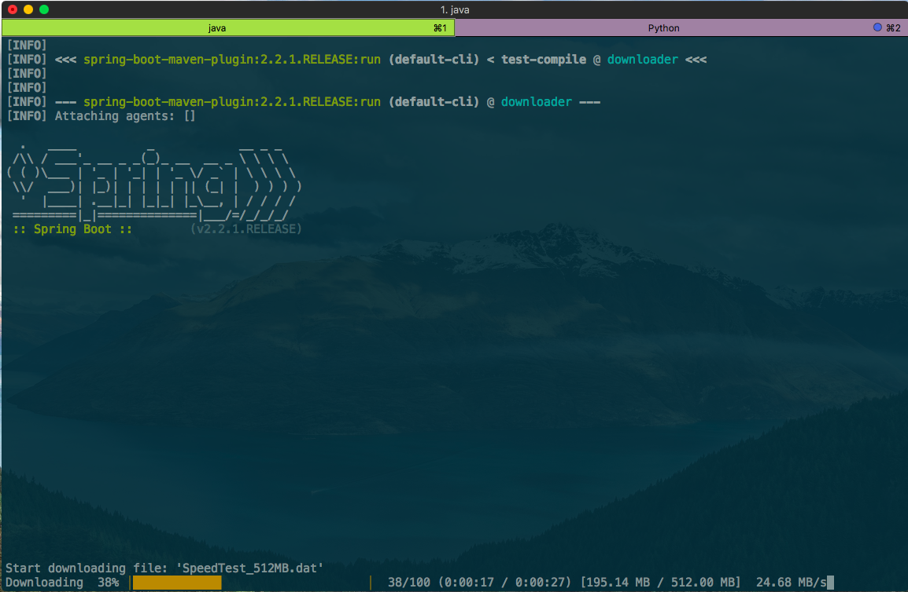

# concurrent-downloader-cli
A command line tool for concurrently downloading file with given url.

## Installation

- Clone the project
- Go to project's root directory in terminal
- Run:
```sh
pip install -- editable .
```
## Usage

- Go to `/concurrent-downloader-cli/downloader-service` in terminal
- Run: (Make sure Maven is installed and `mvn` cli is added to $PATH)
```sh
mvn spring-boot:run
```
to start the downloader web service.
- In a new terminal window, you can run the following commands (in any directory):
```sh
downloader <URL>
downloader <URL> -c <nThreads>
```
to download the file to the current directory.

- In the terminal which runs spring boot server, you can view the download progress:


